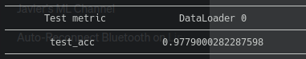

# PixelDA

This is a PixelDA Pytorch Lightning implementation done just with the pourpose of learning more about Pytorch Lightning, Domain Adaptation and GANs.

This repository has been tested on Ubuntu 20.04 using CUDA 11.8 and Pytorch Lightning 2.0.4.

## Installation

To install all the requirements, it is recommended to create a virtual environment. In my case I commonly use pyenv and virtual env for that. In case you want to install it, here is a (good tutorial)[https://realpython.com/intro-to-pyenv/] on how to do so.

After that, you just have to run:

```bash
pip install -r requirements.txt
````

Have into account that sometimes, if you use a different OS or CUDA version, there can be incompatibilities. **ADD DOCKER SUPPORT**

## Model

This model assumes that the differences between the domains are primarlily low-level (due to noise, resolution, illumination, color) rather than high-level (types of objects, geometric variations, etc).

A GAN architecture is used to encourage the generator (G) to produce images tahta are similar to the target domain images. During training, G maps a source image and a noise vector z to an adapted image (target_fake). On the other hand, the discriminator (D) outputs the likelihood d that a given image x has been sampled from the target domain. The discriminator tries to distinguish between fake images produced by the generator and real images from the target domain. 
Notice that usually in GANs, the generator is only conditiones on a noise vecto, but in this case the generator is condiione on a noise vector and an image from the source domain. In addition to the discriminator, the model is also augmented with a classifier (T) which assigns task-specific labels to images, i.e. it classifies the input image.

For more information you can check the [original paper](https://arxiv.org/pdf/1612.05424.pdf) or the [youtube video](https://youtu.be/PqOTBlbOxu8) where this code is explained and deployed.

## Results 

In the original paper, the authors obtained an accuracy over the test dataset of 98.2%. The one we have managed to obtained is a bit lower (97.76%), but very close to the original ones.

|               | Original Paper | Our Implementation |
| ------------- | -------------- | ------------------ |
| Accuracy      | 98.2           | 97.76              |


Here you can see an example of the GAN's performance to translate from MNIST to MNIST-M:


## Training

In order to train the model go to the **root directory** of the repository and run:

```bash
python train.py --config-file mnistm_experiments
```

This will train the model with the default parameters for the experiments. In case you want to train the algorithm with different parameters you will either have to modify the train_configs/mnistm_experiments.py file or create a new one. If you do create a new one, you will have to **create inside the train_configs directory**. Then you can run:

```bash
python train.py --config-file <your own config file>
```

If you have doubts about it, please read the configuration files section at the end of this document.

## Testing

To test our model previously trained, remember to add the path to the pretrained weights of the model in the General params of your configuration file. The pretrained models are stored in runs/checkpoints. After having done this, just run:


```bash
python test.py --config-file <your own config file>
```

And you should see something similar to the following (this were the results obtained using the default configuration file):




## Configuration files

A configuration file will contain the information about different parameters needed for the training process. These are the default values:

```python
from training.configuration import Hyperparams, Dataparams, Generalparams, Configuration

hyperparams = Hyperparams(
    lr = 1e-3,                                  # learning rate
    z_dim = 10,                                 # Dimension for the random noise
    batch_size = 32,                            # Learning rate
    adam_beta_1 = 0.5,                          # Beta 1 for the Adam optimizer
    adam_beta_2 = 0.999,                        # Beta 2 for the Adam optimizer
    epochs = 50,                                # Total number of training epochs
    classification_model = "mnistm_classifier", # At the moment only mnistm_classifier can be selected
    gen_loss_weight = 10,                       # Generator loss weight
    disc_loss_weight = 1,                       # Discriminator loss weight
    task_loss_weight = 1,                       # Classifier loss weight
    gen_res_blocks = 6,                         # Number residual blocks in the generator
    weights_decay = 1e-5,                       # Weight decay for the models parameters (from the paper)
    adv_loss = 'mse',                           # Loss function to be used for training the GAN network. Choose between mse or bce
)

dataparams = Dataparams(
    source_dataset_name = "mnist",  # Source domain dataset
    target_dataset_name = "mnistm", # Traget domain dataset
    model_input_size = 28,          # Input size for the model
    prepare_data_per_node = True,   # Get the data at each node where the model will be trained.
)

generalparams = Generalparams(
    accelerator = 'cuda',      # Hardware acceleration for training
    num_workers=12,            # Number of workers
    devices = [0,],            # Comma separated list containing the gpu/s where the code will be executed. (Example 1 = 0 -- Example 2 = 0,1)
    pretrained_weights = None, # Path to the pretrained_weights
    test_model_epoch = 5,      # Sets the number of epochs to be trained before testing the model.
    log_every_n_steps = 500,   # Sets the number of steps to be executed before logging training info.
)

configuration = Configuration(hyperparams, dataparams, generalparams, verbose=True)
```

## Training results visualization

You can check how the training is going using tensorboard. Every time that you start a training process by running `python train.py --config-file mnistm_experiments`, a directory containing the training information will be created under runs/tensorboard/PixelDA with the name `{source_dataset_name}_2_{target_dataset_name}_{avd_loss}` from the configuration file.

To visualize the training information run:

```bash
tensorboard --logidr=<path to the tensorboard directory>
```
